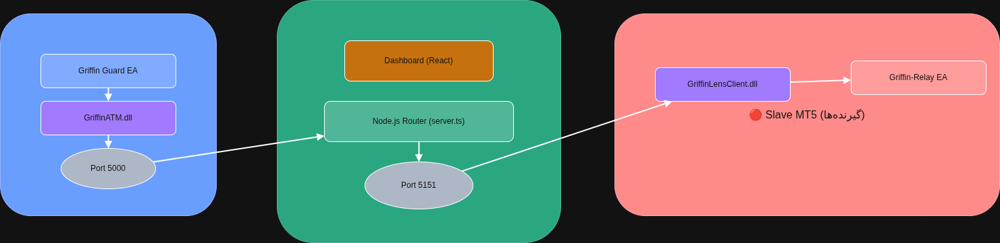

# Griffin Relay - HFT Copy Trading Receiver for MT5 🦅


**Griffin Relay** is an institutional-grade, ultra-fast Trade Copier (Slave) Expert Advisor for MetaTrader 5. 

Unlike traditional copy copiers that rely on slow HTTP `WebRequest` polling, Griffin Relay utilizes a **custom C++ WebSocket DLL (`GriffinLensClient`)** to receive and execute trade signals in real-time. It completely eliminates network overhead, making it capable of High-Frequency Trading (HFT) execution.





## 🔥 Core Features

* **Sub-Millisecond Execution:** Uses a `20ms` millisecond timer to read the DLL command queue, ensuring instant trade mirroring.
* **Dynamic Risk Management:** Automatically calculates the exact lot size based on your specific Risk Percentage (%) and the Master's Stop Loss distance.
* **Full Order Support:** Seamlessly handles Market Orders (`BUY`/`SELL`), Pending Orders (`LIMIT`/`STOP`), and instant closures (`CANCEL`/`CLOSE`).
* **Smart Ticket Mapping:** Internally maps Master Tickets to Slave Tickets to prevent duplicate trades and ensure accurate position closures.

## ⚙️ Installation

1. **The DLL:** Download or compile the `libGriffinLensClient.dll` (from the GriffinLensClient repo) and place it in your MT5 Libraries folder:
   `C:\Users\...\AppData\Roaming\MetaQuotes\Terminal\...\MQL5\Libraries\GriffinLensClient\`
2. **The EA:** Place `Griffin-Relay-expert.mq5` into your MT5 Experts folder:
   `...\MQL5\Experts\`
3. **Compile:** Open MetaEditor, open the EA, and hit **F7** to compile.
4. **MT5 Settings:** Go to `Tools -> Options -> Expert Advisors` and check **"Allow DLL imports"**.

## 🚀 How It Works

1. A central Node.js WebSocket Router broadcasts a JSON trade signal on port `5151`.
2. The `GriffinLensClient.dll` captures the WebSocket payload instantly.
3. The `Griffin Relay EA` reads the DLL buffer, parses the JSON, calculates the required lot size based on your account balance, and executes the trade.

### JSON Signal Structure Example:
```json
{
  "type": "trade_signal",
  "action": "OPEN_POSITION",
  "provider_ticket": 12345678,
  "symbol": "XAUUSD",
  "order_type": 0,
  "price": 2045.50,
  "sl": 2040.00,
  "tp": 2060.00
}

```

## 🎛️ Input Parameters

* **Copy Trading Settings:**
* `Risk Percent`: The exact percentage of your account balance to risk per trade (e.g., `1.0` = 1%).
* `Magic Number`: Unique identifier for trades opened by this EA.


* **System Settings:**
* `Timer Ms`: The scanning frequency of the DLL queue. Default is `20ms` for lightning-fast execution.


## ⚠️ Disclaimer

Trading in financial markets involves high risk. This open-source tool is provided "AS IS" for educational purposes. Always test algorithms extensively on Demo accounts before deploying real capital.

## 📄 License

Licensed under the [GPL v3.0 License](https://www.google.com/search?q=LICENSE).
